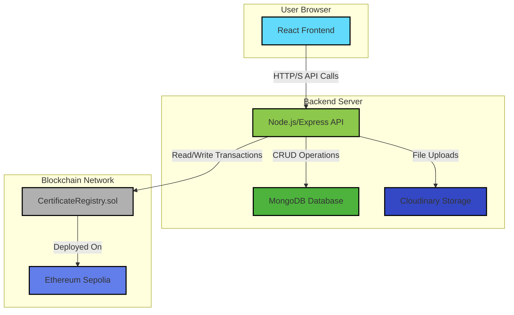

# CertifyChain: Blockchain-Based Secure Certificate Verification

CertifyChain is a full-stack decentralized application that leverages blockchain technology to provide a secure, tamper-proof, and transparent system for issuing, storing, and verifying academic and professional certificates. By storing a unique hash of each certificate on the Ethereum blockchain, it ensures the authenticity and integrity of credentials, eliminating fraud and simplifying the verification process for employers, universities, and other stakeholders.

## Key Features

- **Decentralized & Immutable**: Certificate hashes are stored on the Ethereum Sepolia testnet, making them tamper-proof and globally accessible.
- **Role-Based Access Control**:
  - **Admin**: Manages university accounts (approve/reject).
  - **University/Institution**: Issues certificates, views their own issued certificates, and can revoke them.
  - **User/Employer**: Verifies the authenticity of any certificate by uploading it.
- **Secure File Handling**: Original certificate files (PDF, JPG) are stored securely on Cloudinary, with only their SHA-256 hash on-chain.
- **Email Verification**: New user accounts must be verified via an email link to prevent spam and ensure authenticity.
- **Modern Tech Stack**: Built with React, Node.js, Express, MongoDB, and Solidity for a robust and scalable solution.

## Project Architecture

The project is a monorepo composed of three main parts: a React frontend, a Node.js backend, and a Hardhat blockchain environment.



## Getting Started

### Prerequisites

- [Node.js](https://nodejs.org/) (v18 or later)
- [MongoDB](https://www.mongodb.com/try/download/community) account and connection URI
- [Cloudinary](https://cloudinary.com/) account for file storage
- [Alchemy](https://www.alchemy.com/) or similar RPC provider for Sepolia testnet access
- A crypto wallet (like MetaMask) with some Sepolia ETH for deploying the contract.

### Installation & Setup

1.  **Clone the repository:**
    ```bash
    git clone https://github.com/kaustav3071/Blockchain-Based-Secure-Certificate.git
    cd Blockchain-Based-Secure-Certificate
    ```

2.  **Setup Backend:**
    - Navigate to the `backend` directory: `cd backend`
    - Install dependencies: `npm install`
    - Create a `.env` file by copying `.env.example` (if provided) or creating a new one.
    - Populate the `.env` file with your credentials:
      ```env
      MONGO_URI="your_mongodb_connection_string"
      JWT_SECRET="a_strong_jwt_secret"
      CLOUDINARY_CLOUD_NAME="your_cloudinary_cloud_name"
      CLOUDINARY_API_KEY="your_cloudinary_api_key"
      CLOUDINARY_API_SECRET="your_cloudinary_api_secret"
      SEPOLIA_RPC_URL="your_sepolia_rpc_url"
      WALLET_PRIVATE_KEY="your_wallet_private_key_for_deployment"
      PORT=5000
      CLIENT_URL=http://localhost:5173
      EMAIL_ID="your_gmail_address"
      EMAIL_PASSWORD="your_gmail_app_password"
      ```
    - Run the seed script to create an initial admin user (optional):
      ```bash
      npm run seed:admin
      ```

3.  **Setup Blockchain Contract:**
    - Navigate to the `blockchain` directory: `cd ../blockchain`
    - Install dependencies: `npm install`
    - Update `hardhat.config.js` with your `SEPOLIA_RPC_URL` and `WALLET_PRIVATE_KEY`.
    - Deploy the contract to the Sepolia testnet:
      ```bash
      npx hardhat run scripts/deploy.js --network sepolia
      ```
    - This will deploy the `CertificateRegistry.sol` contract and automatically create a `contractData.json` file in the `backend/config` directory containing the contract's address and ABI.

4.  **Setup Frontend:**
    - Navigate to the `client` directory: `cd ../client`
    - Install dependencies: `npm install`
    - The frontend is configured to proxy API requests to the backend at `http://localhost:5000` via the `vite.config.js` file.

### Running the Application

1.  **Start the Backend Server:**
    - In the `backend` directory, run:
      ```bash
      npm run dev
      ```
    - The server will start on `http://localhost:5000`.

2.  **Start the Frontend Development Server:**
    - In the `client` directory, run:
      ```bash
      npm run dev
      ```
    - The React application will open at `http://localhost:5173`.

Now you can access the application in your browser and interact with it.
